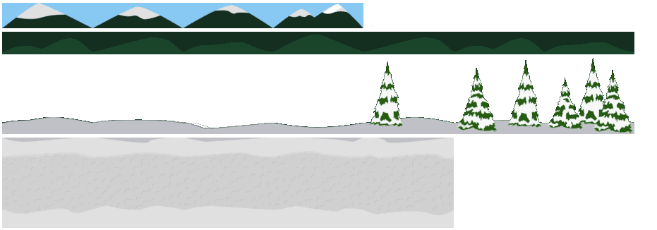
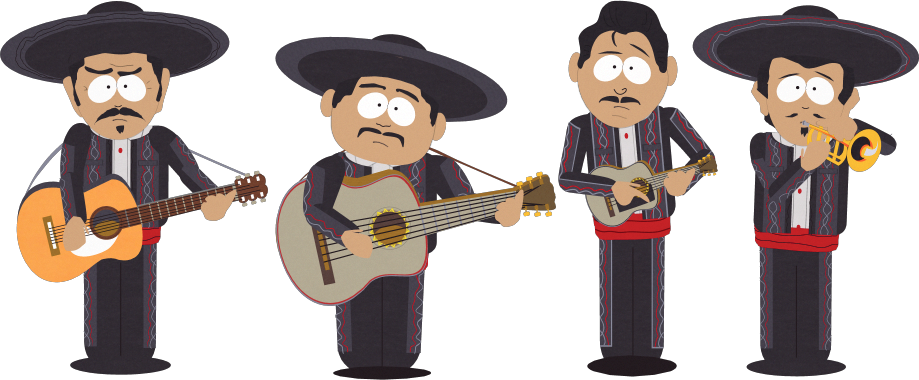
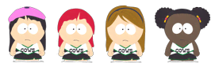
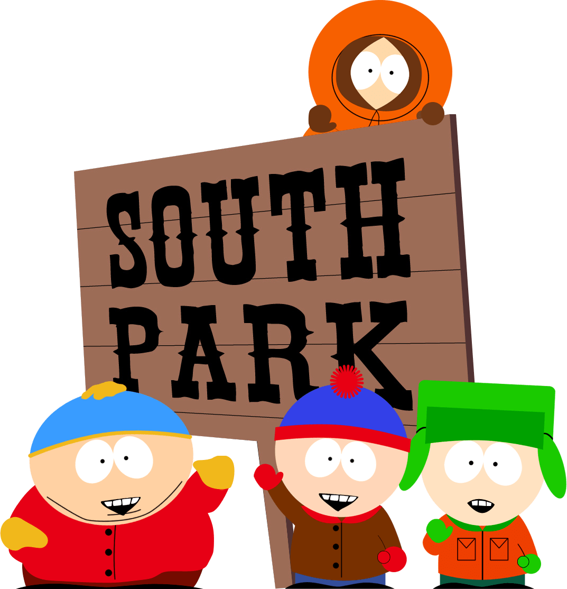

# South Park, The Game

Hi, my name is Giovanni Takeshi Sesta student of Web Develpment at the Ironkack Bootcamp in Madrid and this videogame is my project for the end of the module 1 of the course.

You can play it on devices with keyboard input (PC).

:star: Please add me a star if you like my first project!  :star:

Here is the link to the game: https://giovannitakeshisesta.github.io/South-park-Game/


## The making of
I will show you how is structured the core of the game and the most relevant line of code I used.

The time line of the developping of the project was basicly this one:

- 15% -  Learning how to use Photoshop....

- 15% - Creating all the single elements of the game: the background, the player, the characters.

- 40% - Interactions between all the elements considering a lot of different conditions.
 
 - 5% - Game playability: positioning the characters, the obstacles and the finish line, setting the characters speed, the hit points.

- 5% - End of the game, 3 scenarios: winning, death by hit point, death of Kenny.

- 5% - Sound FX

- 5% - Web page CSS around the canvas

- 5% - Git Hub Pages

- 5% - This readme file
#

## The Background


The background is done using the "parallax" effect:  1 source image with 4 different layers.

Each layer will move at a different speed giving a sensation of false 3d.

To do that we use the Canvas drawImage() method passing the 8 arguments + the speed.

```JS
this.background = [  
  //                ctx.drawImage(ctx, sx, sy, sWidth, sHeight, dx, dy, dWidth, dHeight, speed);
  this.backClass2 = new BackClass(ctx, 10, 180, 10,    10,       0, 310, 1000,   50,     0 ),
  this.backClass6 = new BackClass(ctx, 10, 10,  10,    10,       0, 0,   1000,   50,     0 ),
  this.backClass5 = new BackClass(ctx, 0,  5,   520,   36,       0, 50,  1000,   110,    -0.5 ),
  this.backClass4 = new BackClass(ctx, 0,  41,  900,   36,       0, 134, 2000,   180,    -1 ),
  this.backClass3 = new BackClass(ctx, 0,  80,  900,   113,      0, 90,  2000,   240,    -2.5 ),
  this.backClass1 = new BackClass(ctx, 0,  193, 652.4, 140,      0, 355, 1000,   210,    -3 )];
```
#  
## The Player


The Player class has 4 animations : stand still, moving left or right, falling.  

When a direction key is pressed, we pass to the animation() function 3 arguments:  
- the line of the spritesheet, 
- the starting frame, 
- the ending frame.  

```JS
animation(y,startX, endX){
    this.yFrame = y;  
    if (this.tick % 10 === 0) {
      this.xFrame += 1;
      if (this.xFrame >= endX || this.xFrame < startX) {
        this.xFrame = startX;
      }
    }
  }
  
   // STAND STILL ANIMATION
  if (!this.runningRight && !this.runningLeft) {
    this.animation(0,0,4);
  } 

  // RUNNING ANIMATION
  if (this.runningRight) {
    this.animation(1,0,3);
  }
```
#
## The Cows


The generateCow() function, add cows to the cows array.

It creates a new instance of a Cow every X amount of time (e.g.250), passing as arguments: 

- a random value between 1 and 3 (which cow),

- a random starting point on the destination Y axis.

```JS
generateCow(){
  this.counterGenerateCow++;

  let min = 230;
  let max = 450;
  let startY = Math.floor(Math.random() * (max - min) + min); 

  let cowNumber = Math.floor(Math.random() * 3);

  if (this.counterGenerateCow > 250){
    this.cowArr.push(new Cow(ctx,-200, startY, 200,100,'assets/imgs/allCowsps.png', "cow2",cowNumber));
    this.counterGenerateCow = 0;
  }
}
```
<br />
The move() function of the Cow class, move each cow: 

- on the X axis, towards right,

- on the Y axis, up & down bouncing between 2 values top and bottom,

and when the cow is in the middle, randomly change direction to up or down.


```JS
move() {
  this.animation();
    this.x += 1.5;  // move right
    this.y += this.vy;
    if (this.y === 330 || this.y === 350 ) {  
      this.vy *= (Math.random() < 0.7 ? -1 : 1); // random direction
    }
    if (this.y > 450|| this.y  < 230) { // bounce touching top or bottom
      this.vy *= -1;
    }
  }
```
#
## The Audience

  


There are a lot of South Park citizens, their animation is very simple, use just 2 frames or sometimes 1.

When we create a new instance of a Guest, we pass as arguments: 
- destination coordinates & size, 
- the line of the sprite sheet, 
- the number of frames,  
- frame height in case the picture height is different.

```JS
this.guests = [ 
  //       (ctx, dx,  dy, dw, dh, img,                      line, N.frames, frame height, name)               
  new Guest(ctx,5200,220,130,130,'assets/imgs/tallchar.png' ,  2,     2,    13.05,   "mariachi2"),
  new Guest(ctx,5100,220,130,130,'assets/imgs/tallchar.png' ,  1,     2,    13.05,   "mariachi1"),
  new Guest(ctx,200, 220, 90, 90,'assets/imgs/smallchar.png',  13,    2,    17.02,   "cheer2"),
  new Guest(ctx,300, 230, 90, 90,'assets/imgs/smallchar.png',  14,    2,    17.02,   "cheer1")];
```
#
## The game logic

The collision between two elements is the triggering event for the most of the action in the game.

We are going to use the collision function in a lot of different cases, for example 

- if the player  collides with a guest, is allowed to grab him;

- if the guest is thrown at a cow, when collides, the cow explode;

- if the player collides with a poop or a cow , the hit points total decrease;

- if Kenny collides with a cow... die.

```JS
collides(element_1,element_2) {  // left right top bottom
  if (
    element_1.x < element_2.x  + element_2.width  &&    
    element_1.x + element_1.width > element_2.x   &&      
    element_1.y < element_2.y + element_2.height   &&   
    element_1.y + element_1.height > element_2.y ) 
    {
    return true;
    }
  return false;
}
```
#
## Grabbing & Holding a guest
When the player collides with a guest and Space is pressed, the coordinates of the guest will be the same of the top of the player.
```JS
// if the player IS NOT holding a guest,
// if the player touch a guest,  
// if press Space, 
// the player grab the guest,guest.AmIGrabbed = true 

CollissionPlayerGuest() {
  
  if (this.guests.filter(e => e.AmIGrabbed === true).length === 0){
    this.guests.forEach(guest => { 
      const condition = this.collides(this.player,guest);  
      if (condition && this.player.space && (this.kennyArr.length === 0 || this.kennyArr.some(e => !e.AmIGrabbed)) ) {  
        guest.AmIGrabbed = true;
  } });}
  
  // if the player IS grabbing a guest, 
  // find the guest in the array, and while "space = true" , keep grabbing it
  if (this.guests.filter(e => e.AmIGrabbed === true).length === 1){
    this.guests.forEach(guest => { 
      if (guest.AmIGrabbed && this.player.space) { 
        guest.x = this.player.x -10;
        guest.y = this.player.y -50;
      }
    });
  }
}  
```
#
## Release or Throw a guest
If the player is holding a guest and Space is pressed, if there are cows in the canvas, the guest will fly to them; if there are no cows in the canvas, the guest will be released.

```JS
throwGuest(){
  this.guests.forEach(e => {
    if (e.AmIGrabbed && !this.player.space && !e.amIreleased){
      e.amIreleased = true;
    }
  } );
}

releaseGuest(){
  this.guests.forEach(e => {

    if (e.amIreleased){
      e.AmIGrabbed = false;
      let cowInCanvas = this.cowArr.filter(cow => (cow.x > -50 && cow.x < 850));

      if(cowInCanvas.length > 0){
        cowInCanvas[0].ImGoing2Die = true;

        // guest fly to the cows
        if (cowInCanvas[0].x < e.x) e.x -= 10;
        if (cowInCanvas[0].x > e.x) e.x += 10;
        if (cowInCanvas[0].y  > e.y) e.y += 5;
        if (cowInCanvas[0].y  < e.y) e.y -= 5;
      } 
      else {
        e.AmIGrabbed = false;
        e.amIreleased = false;
      }
    }
  });
}
```

#
## End of the game
When the game is over, we want the game to stop immediately or after few seconds, and show a game over message.
```JS
finishGame(){
// if the player pass the finish line: 
if (this.player.x > this.finish.x +100 ){

  // trigger the congratulations message & run the game in the background
  this.congratulations();

  // after few yards stop the game
  if (Math.round(this.counter/60) > this.finishYards+7){
    clearInterval(this.intervalId);
  }
}  

// if kenny dies :  
if ((this.afterFinish && this.player.x < this.finish.x ) || this.HP <= 0 ){
  
  // wait a little -> play sound
  this.counterDead++;
  if(this.counterDead > 30){
    this.oMgTheyKill.play();
  }
  if(this.counterDead > 190){
    this.kenWohoho.pause()
    this.theme.pause();

    // stop the game -> trigger the game over message
    clearInterval(this.intervalId);
    this.gameOver();
  }
}
```


```JS
gameOver() {
  this.cartMotherF.play();

  // show the Game over message
  this.ctx.save();
  this.ctx.fillStyle = 'rgba(0, 0, 0, 0.7)';
  this.ctx.fillRect(0, 0, this.ctx.canvas.width, this.ctx.canvas.height);

  this.ctx.fillStyle = 'white';
  this.ctx.textAlign = 'center';
  this.ctx.font = 'bold 32px sans-serif';
  this.ctx.fillText('Game Over!', this.ctx.canvas.width / 2, this.ctx.canvas.height / 2);
  this.ctx.restore();
}
```
<p>&nbsp;</p>

#
## Other useful functions and event listeners:
### Canceling an event
This function prevent the scrolling of the webpage while playing and pushing Arrow or Space keys.
```JS
var keys = {};
window.addEventListener("keydown",
  function(e){
    keys[e.keyCode] = true;
    switch(e.keyCode){
        case 37: case 39: case 38:  case 40: // Arrow keys
        case 32: e.preventDefault(); break; // Space
        default: break; // do not block other keys
    }
  },
false);
```
<p>&nbsp;</p>

### Creating and triggering events

This function allows you to show a button on the canvas at a specific moment of the game, reloading the game without refreshing the page manually.

When the event "reload" is dispatched, an event listener remove the CSS class hidden from the HTML button, so the button appears.

```JS
// game.js  
const event = new CustomEvent('reload');
document.dispatchEvent(event);

// index.js
document.addEventListener('reload', () => {
  tryAgainBtn.classList.remove("hidden");
});

// index.js
tryAgainBtn.onclick = () => {
  location.reload();
};
```
---

<h2 align="center">That's all folks,  I hope you enjoyed and see you at the next project!
  
  
</h2>